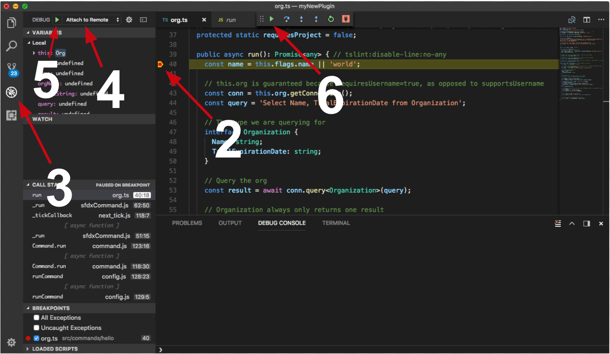

sfdx-heber
==========

SFDX plugin for Salesforce created by Anthony Heber

[](https://npmjs.org/package/sfdx-heber)
[](https://circleci.com/gh/aheber/sfdx-heber/tree/master)
[](https://ci.appveyor.com/project/heroku/sfdx-heber/branch/master)
[](https://codecov.io/gh/aheber/sfdx-heber)
[](https://greenkeeper.io/)
[](https://snyk.io/test/github/aheber/sfdx-heber)
[](https://npmjs.org/package/sfdx-heber)
[](https://github.com/aheber/sfdx-heber/blob/master/package.json)

<!-- toc -->
* [Debugging your plugin](#debugging-your-plugin)
<!-- tocstop -->
<!-- install -->
<!-- usage -->
```sh-session
$ npm install -g sfdx-heber
$ sfdx COMMAND
running command...
$ sfdx (-v|--version|version)
sfdx-heber/0.0.1 win32-x64 node-v10.15.3
$ sfdx --help [COMMAND]
USAGE
  $ sfdx COMMAND
...
```
<!-- usagestop -->
<!-- commands -->
* [`sfdx heber:staticresources:deploy [-c] [-r] [-v <string>] [-u <string>] [--apiversion <string>] [--json] [--loglevel trace|debug|info|warn|error|fatal|TRACE|DEBUG|INFO|WARN|ERROR|FATAL]`](#sfdx-heberstaticresourcesdeploy--c--r--v-string--u-string---apiversion-string---json---loglevel-tracedebuginfowarnerrorfataltracedebuginfowarnerrorfatal)

## `sfdx heber:staticresources:deploy [-c] [-r] [-v <string>] [-u <string>] [--apiversion <string>] [--json] [--loglevel trace|debug|info|warn|error|fatal|TRACE|DEBUG|INFO|WARN|ERROR|FATAL]`

Push static resources to the org and update state tracking for scratch orgs

```
USAGE
  $ sfdx heber:staticresources:deploy [-c] [-r] [-v <string>] [-u <string>] [--apiversion <string>] [--json] [--loglevel 
  trace|debug|info|warn|error|fatal|TRACE|DEBUG|INFO|WARN|ERROR|FATAL]

OPTIONS
  -c, --checkonly                                                                   report resources not already present
                                                                                    in the org

  -r, --createonly                                                                  create resources not already present
                                                                                    in the org

  -u, --targetusername=targetusername                                               username or alias for the target
                                                                                    org; overrides default target org

  -v, --targetdevhubusername=targetdevhubusername                                   username or alias for the dev hub
                                                                                    org; overrides default dev hub org

  --apiversion=apiversion                                                           override the api version used for
                                                                                    api requests made by this command

  --json                                                                            format output as json

  --loglevel=(trace|debug|info|warn|error|fatal|TRACE|DEBUG|INFO|WARN|ERROR|FATAL)  [default: warn] logging level for
                                                                                    this command invocation

EXAMPLE
  $ sfdx heber:staticresources:deploy
```

_See code: [src\commands\heber\staticresources\deploy.ts](https://github.com/aheber/sfdx-heber/blob/v0.0.1/src\commands\heber\staticresources\deploy.ts)_
<!-- commandsstop -->
<!-- debugging-your-plugin -->
# Debugging your plugin
We recommend using the Visual Studio Code (VS Code) IDE for your plugin development. Included in the `.vscode` directory of this plugin is a `launch.json` config file, which allows you to attach a debugger to the node process when running your commands.

To debug the `hello:org` command: 
1. Start the inspector
  
If you linked your plugin to the sfdx cli, call your command with the `dev-suspend` switch: 
```sh-session
$ sfdx hello:org -u myOrg@example.com --dev-suspend
```
  
Alternatively, to call your command using the `bin/run` script, set the `NODE_OPTIONS` environment variable to `--inspect-brk` when starting the debugger:
```sh-session
$ NODE_OPTIONS=--inspect-brk bin/run hello:org -u myOrg@example.com
```

2. Set some breakpoints in your command code
3. Click on the Debug icon in the Activity Bar on the side of VS Code to open up the Debug view.
4. In the upper left hand corner of VS Code, verify that the "Attach to Remote" launch configuration has been chosen.
5. Hit the green play button to the left of the "Attach to Remote" launch configuration window. The debugger should now be suspended on the first line of the program. 
6. Hit the green play button at the top middle of VS Code (this play button will be to the right of the play button that you clicked in step #5).
<br><br>
Congrats, you are debugging!
